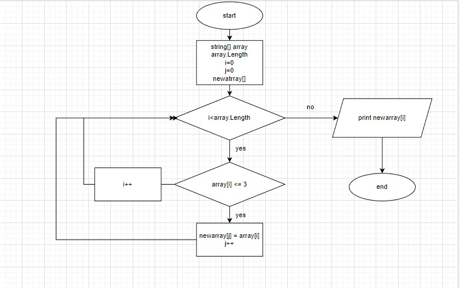

*Итоговая контрольная работа по основному блоку*

1. Создание репозитория https://github.com/nastasiatitova/Itog-kontrol-osn-blok.git
2. Блок схема крешению задачи:

3. Описание решения задачи:
* Вводится массива из строк
* Создание пустого массива для новых строк
* Установка счетчика для нового массива в 0
* Перебор каждой строки в исходном массиве
* Если длина строки меньше или равна 3 символам, то добавление ее в новый массив и увеличение счетчика
* Вывод нового массива.